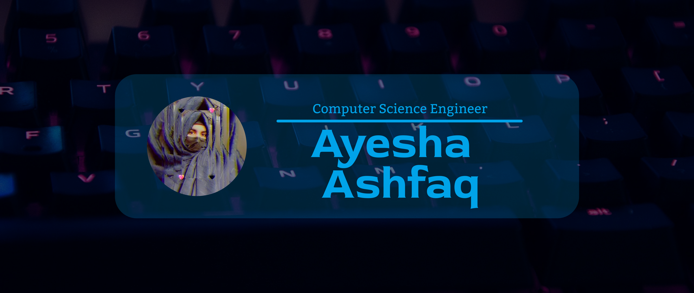

 
<h4 align="justify">
Welcome to my Github profile! I am a passionate developer with expertise in a variety of programming languages and a strong focus on delivering high-quality code. My experience includes developing robust web applications using HTML, CSS, and JavaScript, as well as creating complex algorithms and data structures with Python and C++. I am also proficient in database management and have experience with SQL. My problem-solving skills, attention to detail, and ability to work collaboratively make me a valuable asset to any team. I am committed to staying up-to-date with the latest technologies and best practices, and I am always eager to learn and tackle new challenges. 
A skilled developer with a passion for game development and experience in HTML, CSS, C#, C++, and Python. Along with my technical expertise, I am proficient in Adobe Illustrator and have a keen eye for design. I pride myself on my problem-solving abilities and expertise in data structures. My strong communication skills and experience in client handling have enabled me to deliver successful projects that meet and exceed client expectations. With a dedication to continuous learning and improvement, I am always seeking out new challenges and opportunities to grow as a developer.
A concerned developer and a budding Computer Science Student looking for some exciting new projects and working on new technologies. I have some guarded skills in C# Desktop-Based applications.
 </h4>
   

  

- 🔭 I’m currently working on [Coca-Cola Distribution Management System](https://github.com/AyeshaAshfaq12/Hospital_Management_System)

- 🌱 I’m currently learning **SQL, FRONT-END DEVELOPMENT**

- 💬 Ask me about **C#, C++, PYTHON, HTML, SQL, Desktop Application and Game Development.**

- 📫 How to reach me **ayeshaashfaq925@gmail.com**

- You can checkout my Portfolio at <a href="https://rebrand.ly/AyeshaAshfaq"><b>https://rebrand.ly/AyeshaAshfaq</b></a>

  
<h3> Github Trophies </h3>

  

  
<h3 align="left">Connect with me:</h3>

  

<h3 align="left">Languages and Tools:</h3>

           <a href="https://pandas.pydata.org/" target="_blank" rel="noreferrer">  </a>    

  

