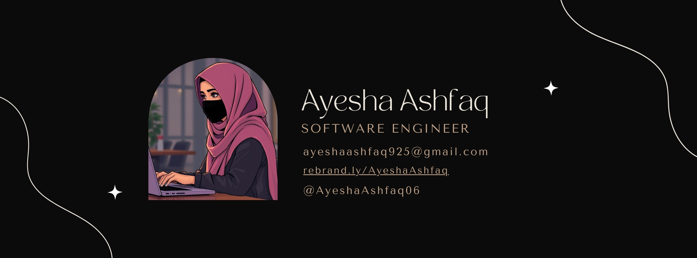

 

 
 

  

## 🚀 About Me

 I am a lifetime student and a passionate Software Engineer from Pakistan 🇵🇰. I have a knack for problem-solving and a love for clean, efficient code. Specialize in building software and web applications, leveraging my expertise in Python, Django, AI, computer vision, and C#.

- I’m currently learning **JAVA, Automation, Selenium, Financial Flows**

- Ask me about **Computer Vision, FinTech, Python and Artificial Intelligence**

  
## Skills & Technologies

`Generative AI` • `Machine Learning` • `Computer Vision` • `Web Development` • `Python` • `JavaScript` • `Django` • `Flask` • `Python` • `React JS` • `Node JS` • `JAVA` • `Selenium` • `Automation` • `Git` • `GitHub` • `Docker` • `Linux` • `OpenAI` • `TensorFlow` • `PyTorch` • `NLTK` • `POstgreSQL` • `MongoDB` • `MySQL` • `Cloudinary` • `Web Scraping` • `Cybersecurity` • `APIs`

  

## Certifications

